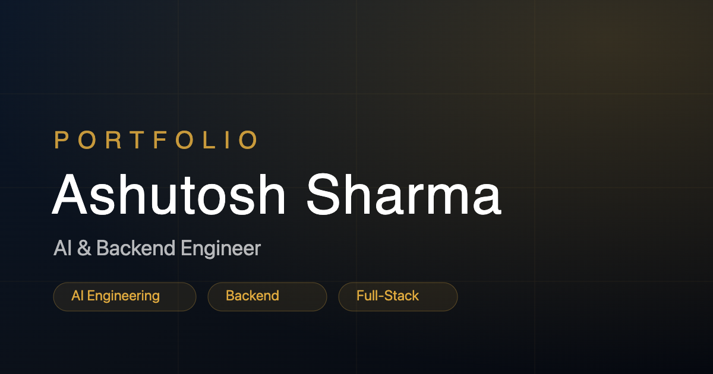

<p align="center">
  
</p>

# Ashutosh Sharma — Portfolio

> An interactive, isometric **3D room** portfolio. Step into the room, click an
> object — or use the top navigation — to explore my projects, experience,
> achievements, skills, and more.


I'm a Computer Science undergraduate and **AI & Backend Engineer**. Instead of a
conventional scrolling page, this portfolio renders a hand-built 3D workspace you
can explore — every object opens a real section of the site.

> **Live demo:** _add your Vercel URL here_

## 📑 Table of Contents

- [Why a 3D room?](#-why-a-3d-room)
- [Highlights](#-highlights)
- [Tech Stack](#%EF%B8%8F-tech-stack)
- [Explore the Room](#-explore-the-room)
- [Controls](#-controls)
- [Getting Started](#-getting-started)
- [Scripts](#-scripts)
- [Project Structure](#-project-structure)
- [Accessibility, Performance & SEO](#-accessibility-performance--seo)
- [Deployment](#%EF%B8%8F-deployment)
- [Documentation](#-documentation)
- [Author](#-author)
- [License](#-license)

## 🎯 Why a 3D room?

Most developer portfolios are a scrolling list of cards. This one is a place you
**explore**. The room is a small, memorable proof of skill in itself — it shows
comfort with 3D math, performance budgeting, state management, and accessibility,
all at once. Crucially, it never sacrifices substance for spectacle: every
interactive object opens a real, content-rich panel, and the entire experience
degrades gracefully to a fast, accessible static version when 3D isn't available.

## ✨ Highlights

- **Interactive 3D room** — built with react-three-fiber, drei, and three.js. Click objects or use the nav; the camera smoothly flies to each focus point.
- **Eight content panels** — About, Experience, Sports, Projects, Skills, Achievements, Powerlifting, and Contact, each an accessible modal dialog.
- **Five featured projects** — overviews, tech badges, status pills, key features, and expandable case studies.
- **Accessibility first** — full keyboard navigation, focus trap + restore, ARIA semantics, visible focus rings, and complete `prefers-reduced-motion` support (UI *and* 3D loops).
- **Resilient** — an error boundary + static fallback keep the site fully usable even when WebGL is unavailable.
- **Animated, intentional** — scroll-reveal sections, count-up stats, and per-device camera presets, all motion-safe.
- **Production SEO** — JSON-LD `Person` schema, Open Graph / Twitter cards, a PNG social preview, and a `<noscript>` fallback.
- **Fast** — the heavy 3D bundle is code-split and lazy-loaded; vendor chunks cache independently; DPR and effects scale down on mobile.

## 🛠️ Tech Stack

| Area | Tools |
| --- | --- |
| **Framework** | React 18, TypeScript |
| **Build** | Vite 5 |
| **3D / graphics** | three.js, @react-three/fiber, @react-three/drei, @react-spring/three |
| **Animation** | Framer Motion |
| **State** | Zustand |
| **Styling** | Tailwind CSS |
| **Tooling** | TypeScript (strict mode), pnpm |
| **Hosting** | Vercel |

## 🧭 Explore the Room

Every section is reachable two ways — by clicking its object in the 3D scene, or
from the top navigation:

| Section | What's inside |
| --- | --- |
| **About** | Bio, focus areas, and animated headline stats |
| **Experience** | Technical & leadership roles (GenAI Club, IIC, Placement Cell) |
| **Sports** | Tug of War — college team & VTU inter-college |
| **Projects** | LGTM, PrepNext, Authentix, AgriSmart, Cardiac Risk Predictor |
| **Skills** | Languages, Backend, Databases & Infra, AI/ML, Blockchain, Tools |
| **Achievements** | Hackathon awards + a 900+ LeetCode counter |
| **Powerlifting** | Squat / Bench / Deadlift personal records |
| **Contact** | Email + social links |

> No hardware acceleration? The site automatically falls back to a fast, fully
> accessible static version with the exact same content.

## 🎮 Controls

| Input | Action |
| --- | --- |
| **Click** an object | Fly the camera to it and open its panel |
| **Top nav / mobile menu** | Jump to any section |
| **`Tab` / `Shift`+`Tab`** | Move focus (trapped inside an open panel) |
| **`Enter` / `Space`** | Activate the focused control |
| **`Esc`** | Close the open panel or mobile menu |
| **Logo** | Return to the default room view |

## 🚀 Getting Started

### Prerequisites
- **Node.js** 18+
- **pnpm** (recommended) — `npm install -g pnpm`

### Installation
```bash
git clone https://github.com/ashutoshsharma1309/portfolio.git
cd portfolio
pnpm install
```

### Run locally
```bash
pnpm dev
```
Then open the printed URL (default **http://localhost:5173**).

## 📜 Scripts

| Command | Description |
| --- | --- |
| `pnpm dev` | Start the Vite dev server with hot-module reload |
| `pnpm build` | Type-check, then build for production into `dist/` |
| `pnpm preview` | Serve the production build locally |
| `pnpm typecheck` | Run the TypeScript compiler with no emit |

## 📁 Project Structure

```
src/
├─ App.tsx                 # App shell: scene, panels, loading, error boundary
├─ main.tsx                # Entry point
├─ index.css               # Tailwind layers + global a11y styles
├─ components/
│  ├─ nav/                 # TopNav (desktop bar + mobile menu)
│  ├─ scene/               # 3D room: Room, Scene, CameraRig, Lighting, Desk,
│  │                       #   Chair, PowerliftingRack, Trophy, Plants, …
│  ├─ ui/                  # Panels + UI: Panel, *Panel, Icon, Reveal,
│  │                       #   AnimatedCounter, LoadingScreen, SceneFallback
│  └─ SceneErrorBoundary.tsx
├─ config/                 # content.ts (single source of truth), links.ts,
│                          #   cameraPositions.ts (per-device camera presets)
├─ hooks/                  # useDeviceTier, usePrefersReducedMotion, useHotspotHover
└─ store/                  # useSceneStore (Zustand)
public/                    # favicon.svg, og-image.svg, og-image.png
```

> **All editable content lives in [`src/config/content.ts`](src/config/content.ts).**
> Add a project, role, skill, or achievement there and the UI adapts automatically.

## ♿ Accessibility, Performance & SEO

**Accessibility**
- Keyboard-navigable throughout; panels are modal dialogs with focus trap, focus restore, and `Escape` to close.
- `prefers-reduced-motion` disables every looping animation — camera drift, trophy/disc spin, plant sway, dust motes, count-ups, and panel transitions.
- Semantic landmarks, an `sr-only` page heading, `aria-current` nav state, decorative icons marked `aria-hidden`, and AA-contrast text.

**Performance**
- The three.js scene is a lazily-loaded, code-split chunk; React and Framer Motion are split into separately-cached vendor chunks.
- Device-tier presets scale DPR, shadow resolution, and ambient effects down on mobile; the canvas isn't rendered behind full-screen mobile panels.

**SEO**
- JSON-LD `Person` structured data, Open Graph + Twitter cards, a 1200×630 PNG preview, descriptive metadata, and a `<noscript>` fallback.

## ☁️ Deployment

Deployed on **Vercel**. Every push to `main` triggers a production build:
```bash
pnpm install --frozen-lockfile
pnpm build        # outputs to dist/
```
Framework preset: **Vite** · Output directory: **`dist`**.

## 👤 Author

**Ashutosh Sharma** — AI & Backend Engineer

- GitHub — [@ashutoshsharma1309](https://github.com/ashutoshsharma1309)
- LinkedIn — [ashutoshsharma1309](https://www.linkedin.com/in/ashutoshsharma1309/)
- LeetCode — [agh0r](https://leetcode.com/u/agh0r/)
- Codeforces — [agh0r](https://codeforces.com/profile/agh0r)

## 📄 License

This is a personal portfolio. The code is free to reference for learning, but the
3D room, copy, and personal content are © Ashutosh Sharma — please don't
republish them as your own portfolio.

---

<p align="center"><em>Built with React, three.js, and a lot of coffee. ☕</em></p>
